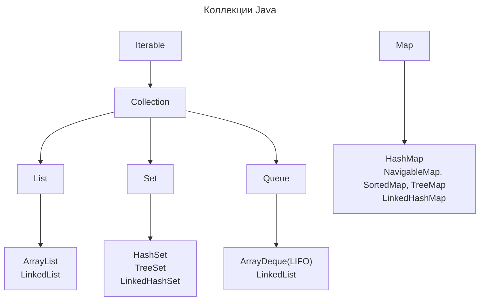

# Лекция от 27.02.24

---

```mermaid
---
title: Коллекции Java
---
graph TD;
    Iterable --> Collection
    Collection --> List --> lists["
        ArrayList
        LinkedList
    "]
    Collection --> Set --> sets["
        HashSet
        TreeSet
        LinkedHashSet
    "]
    Collection --> Queue --> queues["
        ArrayDeque(LIFO)
        LinkedList
    "]

    Map ---> maps["
        HashMap
        NavigableMap, SortedMap, TreeMap
        LinkedHashMap
    "]
```
